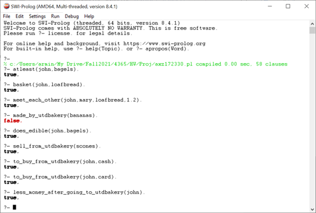

# AI Knowledge Representation
Knowledge Representation paradigm to create a simple question-answering tool.

# Introduction and Problem Definition

For this project, we will use the Knowledge Representation paradigm presented to create a simple question-answering
tool. Specifically, we will design and create a knowledge base in Prolog for shopping at a bakery. Our mission
is to capture, in logical form, enough knowledge to answer a series of questions about this domain.  **Read carefully the project statement given below**. Our mission is to capture, in logical form, enough knowledge to answer
a series of questions about the following simple scenario:

>***Yesterday John went to the UTD Bakery and bought two dozen bagels and a loaf of bread.***

 

***you should be able to put together a consistent set of axioms for the limited questions posed here.***

| ***Question*** | ***Answer*** |
| --- | --- |
| *Does John now have at least two bagels?* | **[Yes]** |
| *Did John buy some bread?* | **[Yes]** |
| *If Mary was buying bread at the same time as John, did he see her?* |
| *Are the bananas made in the bakery?* | **[No]** |
| *What is John going to do with the bagels?* | **[Eat them]** |
| *Does UTD Bakery sell scones?* | **[Yes]** |
| *Did John bring some money or a credit card to the bakery?* | **[Yes]** |
| *Does John have less money after going to the bakery?* | **[Yes]** |

  

# Procedure

>## **Step-1**: Design and Create a Knowledge Base

### *Created a knowledge base, that captured general information about bakeries.* 

- Create hypotheses and try to make the axioms as general as possible. 

 

## Axioms

>*Axioms are separated into two groups as “facts” and “rules.”*

 

| **Facts** | | | | | | | | | | | |
| --- | --- | --- | --- | --- | --- | --- | --- | --- | --- | --- | --- |
| ***Human*** | John | Mary | | | | | |
| ***Weekdays*** | Monday | Tuesday | Wednesday | Thursday | Friday | Saturday | Sunday |
| ***Items*** | Bagels | bread | Buns | Cinnamon rolls | Doughnuts | Coffee | Bananas | Apples | Cookies | Muffins | Scones |
| ***Rack #*** | Bagels#1.1 | bread#1.2 | Buns#1.3 | Scones#1.3 | Cinnamon#1.4 | Doughnuts#1.5 | Coffee#1.6 | Bananas#1.7 | Apples#1.8 | Cookies#1.9 | Muffins#1.10 |
|  ***Growing naturally*** | Bananas |
| ***shopping cart*** | John_has_a loaf_of_bread | John_has_two dozen_bagels |
| ***Money*** | Cash | Card |
| ***Yesterday*** | Wednesday |

 

| **Rules** |
| --- |
| All things are persons if they are human. |
| All Customers are persons who buy from UTD Bakery. |
| All items are in UTD Bakery. |
| All UTD Bakery items have a price. |
| An item sold to UTD Bakery if the thing is in UTD Bakery and grows naturally. |
| All UTD Bakery items are edible. |
| Every UTD Bakery item has a location. |
| Something is bought if a customer purchased an item from UTD Bakery. |
| A Customer has an Item in his basket if that item is their shoppingcart. |
| There is a payment if an item is bought with cash or a card. |
| There is a card payment if an item is bought with a card. |
| There is a card payment if an item is bought with cash. |
| There is At least some item if a customer bought it from UTD Bakery and has that amount on their shopping cart. |
| There is an item that UTD Bakery makes if it is in UTD Bakery, and it is not sold to UTD Bakery. |
| A customer has cash or a card if the customer wants to go to UTD Bakery. |
| A person has less money after going to UTD Bakery if that person is a customer and makes a payment with cash or card. |
| An Item is eaten by the customer if edible and has it in their shopping cart. |
| All things are selling if they are in UTD Bakery. |
| Two-person see each other if they are a customer and are at the exact location simultaneously. |

 

>## **Step-2**: Convert your KB to First Order Logic (Prolog)

Convert the axioms we created in Task 1 into first order logic. 

| **Facts** | **FOL** |
| --- | --- |
| John is a human. | human(john) |
| Mary is a human. | human(mary) |
| Monday is a weekday. | weekday(monday) |
| Tuesday is a weekday. | weekday(tuesday) |
| Wednesday is a weekday. | weekday(wednesday) |
| Thursday is a weekday. | weekday(thursday) |
| Friday is a weekday. | weekday(friday) |
| Saturday is a weekday. | weekday(saturday) |
| Sunday is a weekday. | weekday(sunday) |
| Bagels are an item. | item(bagels) |
| Loaf bread is an item. | item(loafbread) |
| Buns are an item. | item(buns) |
| Cinnamon rolls are an item. | item(cinnamonrolls) |
| Doughnuts are an item. | item(doughnuts) |
| Coffee is an item. | item(coffee) |
| Bananas are an item. | item(bananas) |
| Apples are an item. | item(apples) |
| Cookies are an item. | item(cookies) |
| Muffins are an item. | item(muffins) |
| Scones are an item. | item(scones) |
| Bagels are at rack number 1.1. | rack(bagels,1.1) |
| Loaf bread is at rack number 1.2. | rack(loafbread,1.2) |
| Buns are at rack number 1.3. | rack(buns,1.3) |
| Scones are at rack number 1.3. | rack(scones,1.3) |
| Cinnamon rolls are at rack number 1.4. | rack(cinnamonrolls,1.4) |
| Doughnuts are at rack number 1.5. | rack(doughnuts,1.5) |
| Coffee is at rack number 1.6. | rack(coffee,1.6) |
| Bananas are at rack number 1.7. | rack(bananas,1.7) |
| Apples are at rack number 1.8. | rack(apples,1.8) |
| Cookies are at rack number 1.9. | rack(cookies,1.9) |
| Muffins are at rack number 1.10. | rack(muffins,1.10) |
| John has a loaf of bread in his shopping cart. | shoppingcart(john,loafbread,1) |
| John has two dozen bagels in his shopping cart. | shoppingcart(john,bagels,2) |
| Cash is money. | money(cash) |
| Card is money. | money(card) |
| Bananas are growing naturally. | grows_natural(bananas) |
| Apples are growing naturally. | grows_natural(apples) |
| Yesterday was wednesday. | yesterday(X) :- weekday(X),X = wednesday |

 

| **Rules** | **FOL** |
| --- | --- | 
| All things are persons if they are human.| person(X) :- human(X). |
| All Customers are persons who buy from UTD Bakery.| buy_from_utdbakery(X) :- person(X)   customer(X) :- buy_from_utdbakery(X). |
| All items are in UTD Bakery.| utdbakery(X) :- item(X). |
| All UTD Bakery items have a price.| price(X) :- utdbakery(X). |
| An item sold to UTD Bakery if the thing is in UTD Bakery and grows naturally.| sold_to_utdbakery(X) :- utdbakery(X), grows_natural(X). |
| All UTD Bakery items are edible.| edible(X) :- utdbakery(X). |
| Every UTD Bakery item has a location.| location(X,Y) :-utdbakery(X), rack(X,Y). |
| Something is bought if a customer purchased an item from UTD Bakery.| buy(X,Y) :- customer(X), utdbakery(Y). |
| A Customer has an Item in his basket if that item is their shoppingcart.| basket(X,Y) :- customer(X),shoppingcart(X,Y,Z), Z > 0. |
| There is a payment if an item is bought with cash or a card.| payment(X,Y,Z) :- buy(X,Z),money(Y), price(Z). |
| There is a card payment if an item is bought with a card.| card_payment(X,Y,Z) :- buy(X,Z),payment(X,Y,Z), Y = card. |
| There is a card payment if an item is bought with cash.| card_payment(X,Y,Z) :- buy(X,Z),payment(X,Y,Z), Y = cash. |
| There is At least some item if a customer bought it from UTD Bakery and has that amount on their shopping cart.| atleast(X,Y) :- customer(X), buy(X,Y), shoppingcart(X,Y,Z), Z >= 2. |
| There is an item that UTD Bakery makes if it is in UTD Bakery, and it is not sold to UTD Bakery.| made_by_utdbakery(X) :- utdbakery(X), not (sold_to_utdbakery(X)). |
| A customer has cash or a card if the customer wants to go to UTD Bakery.| to_buy_from_utdbakery(X,Y) :- customer(X), money(Y). |
| A person has less money after going to UTD Bakery if that person is a customer and makes a payment with cash or card. | less_money_after_going_to_utdbakery(X) :- customer(X), payment(X,_,_),!. |
| An Item is eaten by the customer if edible and has it in their shopping cart. | does_edible(X,Y) :- customer(X), edible(Y), shoppingcart(X,Y,Z), Z > 0. |
| All things are selling if they are in UTD Bakery. | sell_from_utdbakery(X) :- utdbakery(X). |
| Two-person see each other if they are a customer and are at the exact locationsimultaneously. | meet_each_other(X,Y,Z,R) :- customer(X), customer(Y), utdbakery(Z), location(Z,R), yesterday(_),!. |

 

>## Step-3: Question Answering

Used Prolog to design our question-answering system. we able to put together a consistent set of axioms to be able to answer some simple questions around the domain.

 
 

# References

1. Stuart Russell and Peter Norvig. Artificial Intelligence: A Modern Approach. 3rd Edition, Prentice Hall Press, 2009.
2. Christiane Fellbaum. WordNet: An Electronic Lexical Database. Bradford Books, 1998.
3. Kurt Bollacker, Colin Evans, Praveen Paritosh, Tim Sturge, and Jamie Taylor. Freebase: a collaboratively created graph database for structuring human knowledge. In Proceedings of the 2008 ACM SIGMOD international conference on Management of data, pages 1247–1250, 2008.
